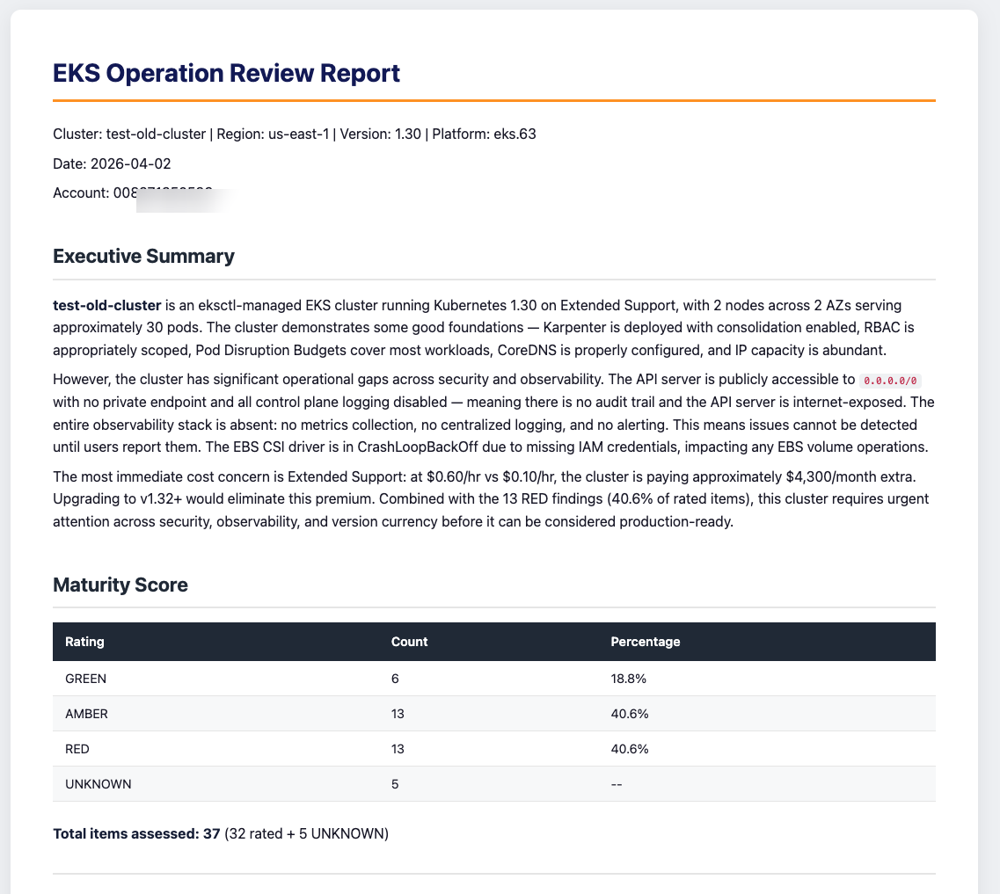
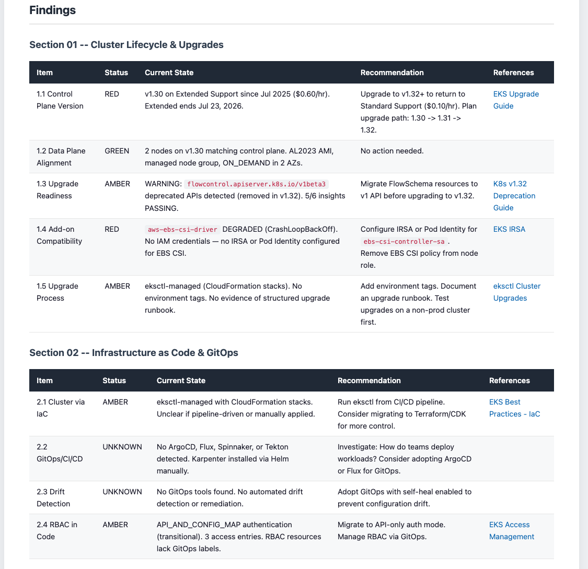

# EKS Operation Review Skill

[](LICENSE)
[](https://www.python.org/)
[](https://claude.ai/claude-code)

A [Claude Code](https://claude.ai/claude-code) skill that performs automated EKS operational excellence assessments. It connects to a live EKS cluster, checks 37 items across 10 operational areas, and produces a rated report with prioritized recommendations.

Checks are informed by the [EKS Best Practices Guide](https://docs.aws.amazon.com/eks/latest/best-practices/) and [EKS User Guide](https://docs.aws.amazon.com/eks/latest/userguide/). All operations are **read-only** — the skill does not modify your cluster.

<p align="center">
  
</p>

## Table of Contents

- [Getting Started](#getting-started)
- [What Gets Assessed](#what-gets-assessed)
- [Output](#output)
- [MCP Server Setup](#mcp-server-setup)
- [Required Permissions](#required-permissions)
- [Limitations](#limitations)
- [Troubleshooting](#troubleshooting)
- [Project Structure](#project-structure)
- [Contributing](#contributing)
- [Security](#security)
- [License](#license)

## Getting Started

### Prerequisites

- [Claude Code](https://docs.anthropic.com/en/docs/claude-code) installed
- [Python 3.10+](https://www.python.org/) and [uv](https://docs.astral.sh/uv/getting-started/installation/)
- AWS credentials configured — `aws sts get-caller-identity` should succeed

### Quick Start

```bash
git clone https://github.com/kahhaw9368/eks-operation-review-skill.git
cd eks-operation-review-skill
claude
```

On first launch, Claude Code will prompt you to enable two MCP servers from `.mcp.json`. **Enable both** — they are required for the skill to work:

- `awslabs.eks-mcp-server` — connects to your EKS cluster
- `awslabs.aws-documentation-mcp-server` — looks up AWS documentation during assessment

Then run:

```
/eks-review
```

The skill discovers your EKS clusters, asks you to pick one, and walks you through the assessment.

## What Gets Assessed

| # | Area | Examples |
|---|------|----------|
| 01 | Cluster Lifecycle | Version currency, upgrade readiness, deprecated APIs |
| 02 | Infrastructure as Code | IaC provenance, GitOps tools, drift detection |
| 03 | Access & Identity | IRSA / Pod Identity, RBAC, API server endpoint, Pod Security Admission |
| 04 | Observability | Control plane logging, metrics, log aggregation, alerting |
| 05 | Workload Configuration | Resource requests, health probes, PDBs, image tags |
| 06 | Networking | IP capacity, CoreDNS, network policies |
| 07 | Autoscaling | Karpenter / CA, HPA, topology spread |
| 08 | Deployment Practices | Rollout strategy, CI/CD, graceful shutdown |
| 09 | Operational Processes | Backup / DR, runbooks, on-call |
| 10 | Add-on Management | Managed add-ons, node health monitoring, cluster insights |

~70–75% of items are fully automatable. Items that require human knowledge (runbooks, on-call processes) are marked UNKNOWN with suggestions for what to investigate.

## Output

Reports are generated in the workspace root:

| Format | Filename |
|--------|----------|
| Markdown | `EKS-Operation-Review-<cluster>-<date>.md` |
| HTML (optional) | `EKS-Operation-Review-<cluster>-<date>.html` |

Each report includes an executive summary, maturity score, per-section findings table, prioritized actions (Critical / Important / Quick Wins), and AWS documentation references.

<details>
<summary><strong>Sample findings detail</strong></summary>
<br>
<p align="center">
  
</p>
</details>

## MCP Server Setup

This skill uses two MCP servers, both pre-configured in `.mcp.json`. No setup is needed for the default configuration — just clone and run.

<details>
<summary><strong>Switching to the AWS-Managed EKS MCP Server</strong></summary>

The default uses the [open-source EKS MCP server](https://github.com/awslabs/mcp). If your team needs CloudTrail audit logging, automatic updates, or the built-in troubleshooting knowledge base, you can switch to the [AWS-managed EKS MCP server](https://docs.aws.amazon.com/eks/latest/userguide/eks-mcp-introduction.html) instead.

1. Attach the `AmazonEKSMCPReadOnlyAccess` managed policy to your IAM user/role.
2. Replace the `awslabs.eks-mcp-server` block in `.mcp.json` (replace `{region}` with your AWS region):

```json
"awslabs.eks-mcp-server": {
  "command": "uvx",
  "args": [
    "mcp-proxy-for-aws@latest",
    "https://eks-mcp.{region}.api.aws/mcp",
    "--service", "eks-mcp",
    "--profile", "default",
    "--region", "{region}",
    "--read-only"
  ]
}
```

> **Important:** The server name (`"awslabs.eks-mcp-server"`) must stay exactly as shown. Claude Code uses this name to route tool calls — changing it will prevent the skill from working.

See the [Getting Started guide](https://docs.aws.amazon.com/eks/latest/userguide/eks-mcp-getting-started.html) for full setup instructions.

</details>

<details>
<summary><strong>Using a specific AWS profile or region</strong></summary>

Update the `env` block for the EKS MCP server in `.mcp.json`:

```json
"env": {
  "AWS_PROFILE": "your-profile",
  "AWS_REGION": "us-west-2",
  "FASTMCP_LOG_LEVEL": "ERROR"
}
```

</details>

<details>
<summary><strong>Already have MCP servers configured globally?</strong></summary>

Claude Code merges MCP config from global (`~/.claude/settings.json`) and project (`.mcp.json`) levels. If you already have an EKS MCP server configured globally:

- **Same server name** (`awslabs.eks-mcp-server` in both) — the project config takes precedence. No action needed.
- **Different server name** (e.g., `eks-mcp` globally) — both servers will run. Disable the duplicate to avoid conflicts.

</details>

## Required Permissions

### AWS IAM

Minimum IAM permissions:

```
eks:ListClusters, eks:DescribeCluster, eks:ListNodegroups,
eks:DescribeNodegroup, eks:ListAddons, eks:DescribeAddon,
eks:ListInsights, eks:DescribeInsight, eks:ListAccessEntries,
eks:ListPodIdentityAssociations, eks:DescribeAddonVersions
ec2:DescribeSubnets, ec2:DescribeVpcs
iam:ListAttachedRolePolicies, iam:ListRolePolicies,
iam:GetPolicy, iam:GetPolicyVersion
logs:DescribeLogGroups
cloudwatch:DescribeAlarms
```

> **Tip:** If using the AWS-managed EKS MCP server, attach the `AmazonEKSMCPReadOnlyAccess` managed policy instead.

### Kubernetes RBAC

Your IAM identity needs read access to Kubernetes resources (Nodes, Pods, Deployments, Services, etc.) via an [EKS access entry](https://docs.aws.amazon.com/eks/latest/userguide/access-entries.html) or `aws-auth` ConfigMap.

## Limitations

- **One cluster at a time** — run the skill again for additional clusters.
- **Process questions are UNKNOWN** — items like runbooks, on-call rotation, and post-incident reviews cannot be detected from cluster state. These are marked UNKNOWN with investigation guidance.
- **Point-in-time snapshot** — reflects cluster state at the time of the run; does not monitor ongoing changes.
- **Requires cluster access** — your IAM identity must have both AWS API permissions and Kubernetes RBAC access.

## Troubleshooting

<details>
<summary><strong>MCP server not responding</strong></summary>

1. Check Python and uv are installed: `uv --version`
2. Check AWS credentials: `aws sts get-caller-identity`
3. Test the MCP server directly: `uvx awslabs.eks-mcp-server@latest`
4. Verify `AWS_PROFILE` and `AWS_REGION` in `.mcp.json` match your environment

</details>

<details>
<summary><strong>No clusters found</strong></summary>

The skill lists clusters in the region configured in your AWS credentials. To target a different region, set `AWS_REGION` in `.mcp.json` or your environment.

</details>

<details>
<summary><strong>Permission denied errors</strong></summary>

Ensure your IAM identity has the permissions listed in [Required Permissions](#required-permissions) and has a Kubernetes RBAC binding via [EKS access entry](https://docs.aws.amazon.com/eks/latest/userguide/access-entries.html) or `aws-auth` ConfigMap.

</details>

## Project Structure

```
.claude/commands/eks-review.md   # Skill entry point
CLAUDE.md                        # Instructions for Claude Code
.mcp.json                        # MCP server configuration
steering/                        # Per-section check instructions
  cluster-lifecycle.md
  infrastructure-as-code.md
  access-identity.md
  observability.md
  workload-configuration.md
  networking.md
  autoscaling.md
  deployment-practices.md
  operational-processes.md
  addon-management.md
  report-generation.md
tools/report_to_html.py          # Markdown → HTML converter
```

## Contributing

Contributions are welcome. Please [open an issue](https://github.com/kahhaw9368/eks-operation-review-skill/issues) first to discuss what you'd like to change.

## Security

This skill is **read-only** and does not create, modify, or delete any AWS or Kubernetes resources. All operations are describe, list, and get calls.

If you discover a security issue, please report it via [GitHub Issues](https://github.com/kahhaw9368/eks-operation-review-skill/issues) rather than a public comment.

## License

This project is licensed under the [MIT License](LICENSE).
